# Scaling APM Server over 8GB

This folder contains the results of running the `apmbench` benchmarks against an Elastic Cloud
deployment 8GB or higher. The idea is to improve resource utilization on the APM Server side,
since preliminary data indicates that the current internal architecture doesn't automatically
scale-up as well as we would have liked. Initial benchmarks are available in `scaling/initial`.

The main issue on the APM Server is that CPU utilization remains ~30-45% with the default settings
on an 8GB instance with the `BenchmarkAgentAll` and `BenchmarkOTLP` benchmarks.

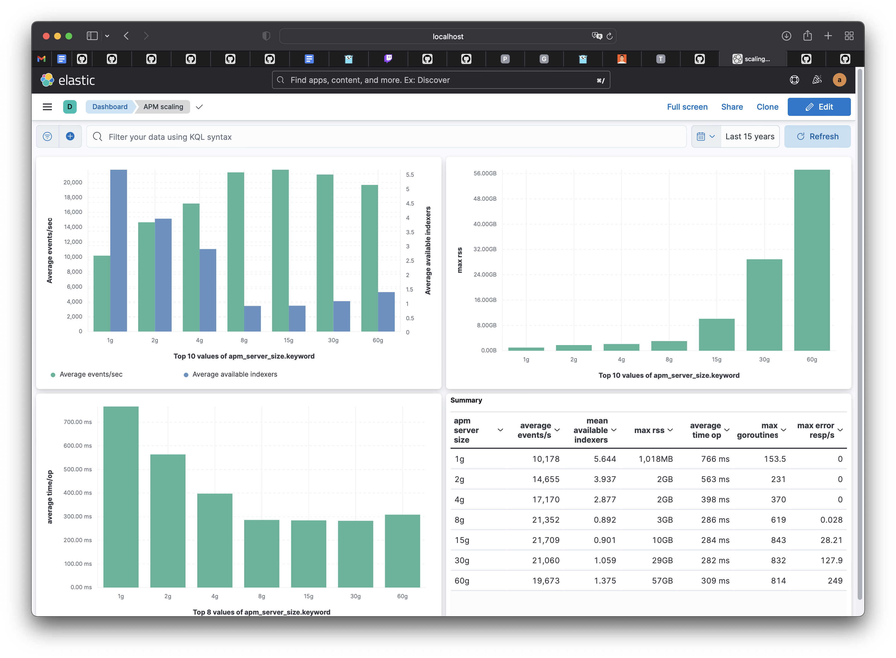

| APM Server size | ES instance size | ES instances | ES dedicated masters | ES zones | Hardware      |
| --------------- | -----------------| ------------ | -------------------- | -------- |-------------- |
| 8 GB            | 58GB             | 6            | 3                    | 3        | CPU Optimized |
| 15 GB           | 58GB             | 6            | 3                    | 3        | CPU Optimized |

_The size above is the maximum deployment size we can create in the Elastic Cloud QA environment._

## Background

APM Server can only process events as fast as it can send them to Elasticsearch. An undersized Elasticsearch
will create backpressure which will be manifested as reduced APM Server throughput. Determining whether
Elasticsearch is undersized or correctly tuned can be tricky at times and has not been the main focus of
our experiments so far.

Since version `8.0.0`, APM Server uses a custom Elasticsearch output instead of the libbeat publisher that
is used up to that version. The most important change in this version is that incoming requests will be processed
and added to a local bulk indexer cache (in its wire-data form) synchronously, instead of using an internal
Go queue to communicate with the libbeat publisher. Additionally, bulk requests will be filled up to 5MB in
size (default) or flushed ever 1 second, whichever is first. This has the benefit of creating fuller Elasticsearch
bulk requests, resulting in fewer sparse bulk requests (i.e. a lot of requests, with few items).

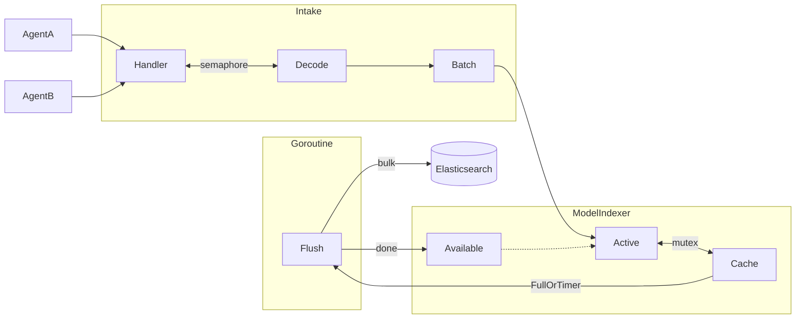

Prior to `8.0.0`, the APM Server returned _503: queue is full_ response if requests couldn't be added to the
libbeat publisher within 1 second, which unintendedly provided a beneficial resource usage limit. From `8.1.2`
onwards, we added an internal semaphore with a size of `200`, to prevent the APM Server from running out of memory
when the output rate is lower than the request input rate, in other words, if APM Server can't index events to
Elasticsearch faster or at an equal rate it is receiving them, it mustn't run out of memory. The `200` size is based
on the maximum `batch size of 10 events * 300KB maximum event size * concurrent requests = ~600MB` which allows
the minimum size in cloud (1g) to not run out of memory when it is overwhelmed.

## Benchmarking methodology

To assess the performance of APM Server, we need to send events to the APM Server as fast as we can
in order to determine what the maximal throughput can be. The chosen tool is `apmbench` for load generation
using a set number of _simulated_ apm agents. The number of agents that we've chosen to use is between 512
and 1024.

For the sake of scaling, and data gathering, we have been benchmarking using different Elasticsearch shard
settings for the APM Server data streams. The maximum number of shards that we have tested with is 24 shards
for all APM Server data streams.

We also collected data on how APM Server and Elasticsearch behaved with different bulk request sizes; the
benchmarked maximum request sizes were 5, 3, 2, and 1 megabyte in size.

As benchmarking progressed, we forced APM Server to write to a no-op Elasticsearch (discarding bulk requests
into the void, rather than sending them to Elasticsearch), and there was significant contention on the mutex
of the custom Elasticsearch output. This led to more experiments using multiple active indexers (which fill
a single bulk indexer until full or timeout elapses before flushing in the background), rather than a single
active indexer. See the diagram below for an aproximation of the design used:

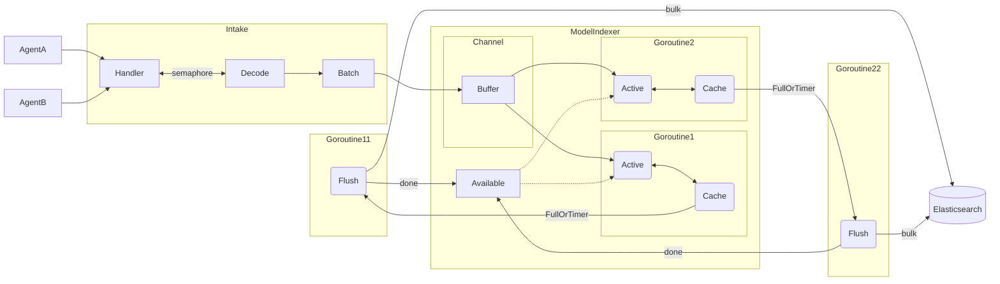

### Hypothesis

After the initial benchmarks with APM Server `8.4.0`, it was clear that the APM Server didn't perform any
better when granted more than 8gb of RAM. The maximal throughput achieved was ~26500 events per second and
it didn't do any better with more CPU or RAM. The maximum CPU utilization hovered around 50%, so it was clear
that we were experiencing a bottleneck somewhere in the ingestion pipeline.

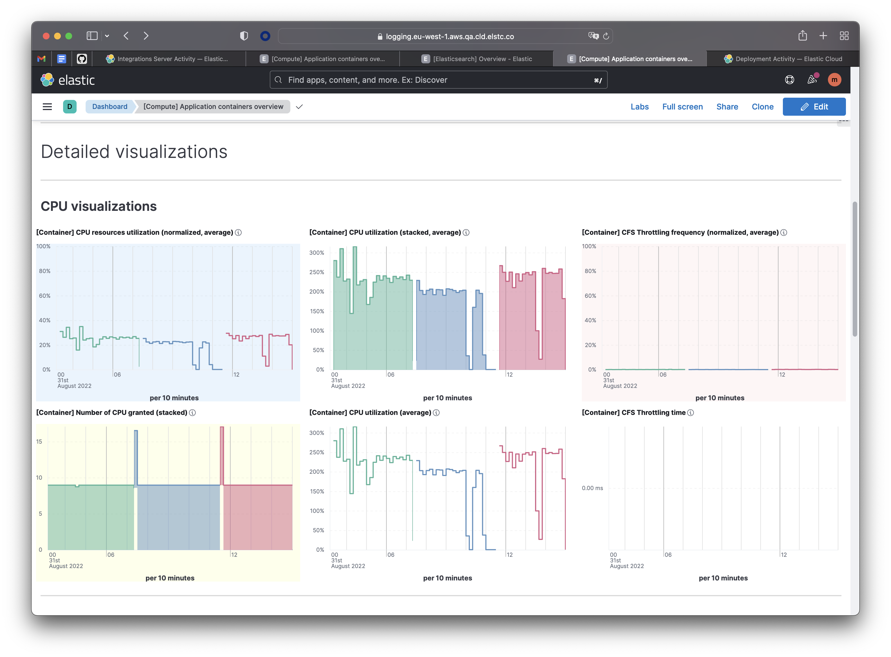

We had two main hypothesis. The first one that Elasticsearch wasn't indexing the documents fast enough and the
one that that the semaphore [introduced in `8.1.2`](https://github.com/elastic/apm-server/pull/7809) was limiting
the throughput.

Additionally, looking at the Elasticsearch CPU usage across hot nodes it seemed clear that the Elasticsearch wasn't
being pushed to its limit, and we needed to also improve that.

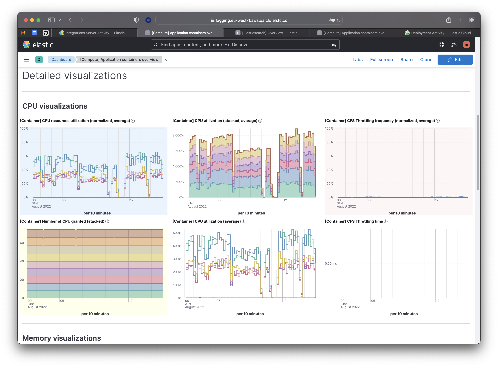

#### 1A: Elasticsearch shard tuning, concurrent bulk indexers

After increasing the benchmark Elasticsearch cluster from `4 x 58gb hot_content` nodes to `6`, and benchmarked the
server with different shard settings: `1`, `5`, `10`, `15`, `20`, `24`. Since our initial hypothesis was that the
semaphore may be limiting throughput, we decided to test only using the OTLP benchmark, since OTLP isn't limited by
it.

Surprisingly, throuhgput didn/t skyrocket and since the mean available indexers was pretty low (0.9), concluded that
10 indexers may not be enough and that long flushes may be slowing processing down in the APM Server. It seemed
plausible given that Elasticsearch bulk requests took up to 25 seconds (99 percentile). The first module of the
response time distribution chart represents the benchmark with 10 available indexers, which is the default.

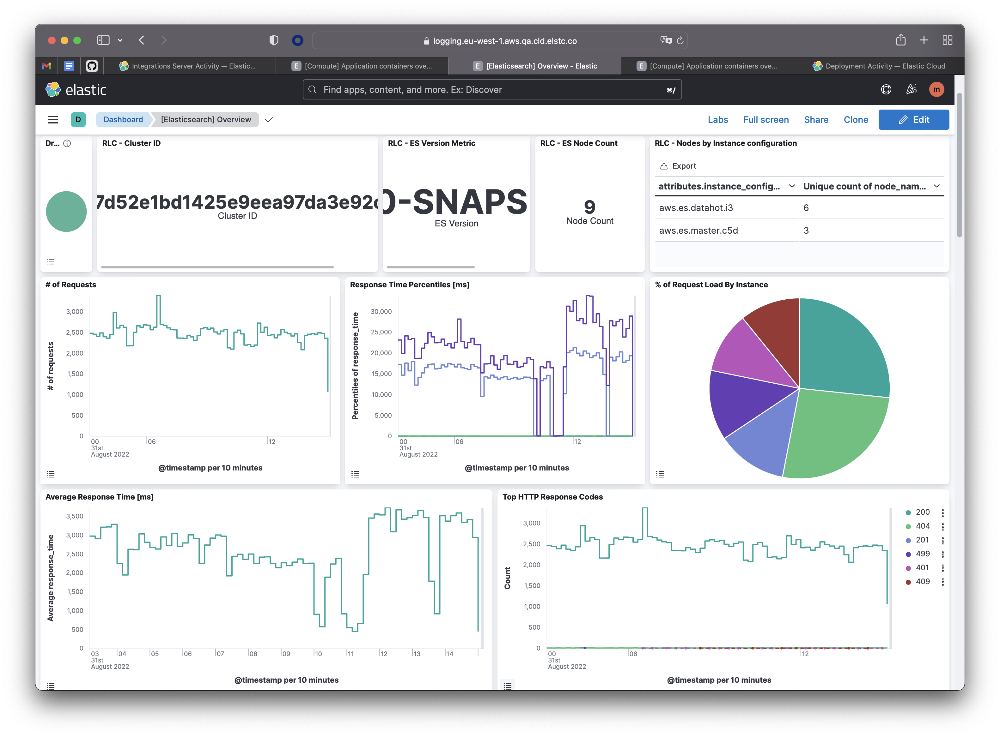

Adding a few more indexers resulted in better throughput, 20 indexers yield ~20% more throughput:

```console
# 10 available indexers (default)
name            events/sec
OTLPTraces-512               37.8k ± 4%
name            mean_available_indexers
OTLPTraces-512                1.02 ±12%
# 15 available indexers
name            events/sec
OTLPTraces-512               45.6k ± 4%
name            mean_available_indexers
OTLPTraces-512                2.03 ± 8%
# 20 available indexers
name            events/sec
OTLPTraces-512               46.1k ± 1%
name            mean_available_indexers
OTLPTraces-512                4.61 ±10%
```

```console
$ benchstat -alpha 1.1 old.txt new.txt
name            old events/sec               new events/sec               delta
OTLPTraces-512                   37.8k ± 4%                   46.1k ± 1%   +22.09%  (p=0.100 n=3+3)
```

However, the response time was still extremely high (see the rightmost module in the distribution, going up to 30 seconds!).
It may be that the buffered size (FlushBytes) is too big and the bulk requests that are being sent to Elasticsearch are too
big as well, resulting in increased processing time.

At this point, the CPU usage still remained around 30-45%.

#### 1B: FlushBytes is too high

Next, multiple APM Server builds were created and benchmarked, 3, 2 and 1 megabytes was tested as the FlushBytes setting,
with 10, 15 and 20 indexers. Last, 40 available indexers was also tested for the smallest 1mb FlushBytes setting.

The detailed results are present in the branch, but in summary, 1MB flushes with 20 available indexers resulted in the
better throughpuyt (+6.5%), and also lowered response times as it would be expected with smaller bulk request sizes.
Increasing the number of available indexers to 40 resulted in 12.5% more throughput in total. The overall indexer
utilization was lower for the 40 available indexers for the OTLP bechmark.

```console
# 5MB flushes with 20 available indexers vs 1MB flushes with 20 available indexers
name            old events/sec               new events/sec               delta
OTLPTraces-512                   46.1k ± 1%                   49.2k ± 5%      +6.66%  (p=0.100 n=3+3)
name            old events/sec               new events/sec               delta
OTLPTraces-512                   46.1k ± 1%                   51.9k ± 2%     +12.54%  (p=0.100 n=3+3)
```

```console
# 1MB flushes with 20 available indexers vs 1MB flushes with 40 available indexers
name            old mean_available_indexers  new mean_available_indexers  delta
OTLPTraces-512                    1.52 ± 7%                    7.36 ±15%  +383.25%  (p=0.100 n=3+3)
```

CPU usage was higher, 30 to ~55%, yet we still weren't maximizing the CPU resources in the 8g instance. So we had another
area that was causing a significant bottleneck.

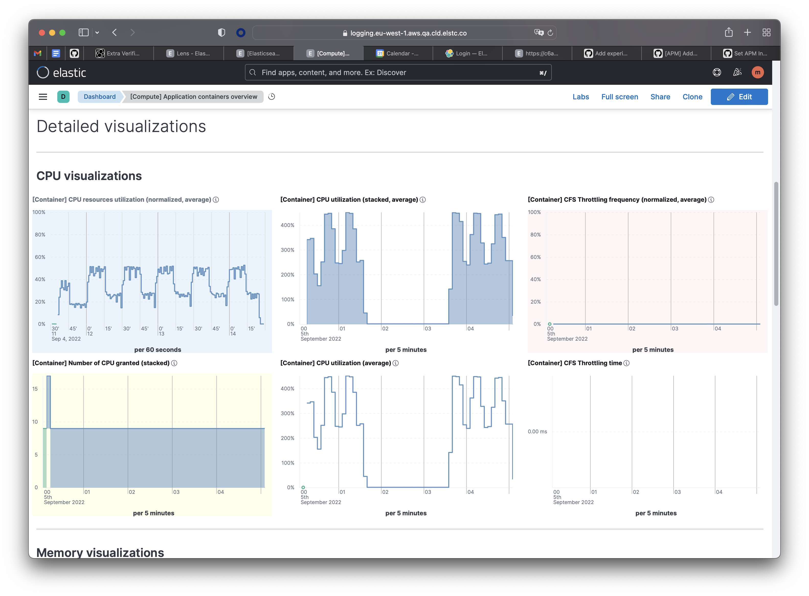

#### 2: Semaphore is the bottleneck

The next area of the code where we were likely to be experiencing a bottleneck is the semaphore with a size of 200
in the HTTP intake API. This semaphore's main goal is to limit the memory usage on the APM Sever and avoid running
out of memory when the APM Server is overwhelmed. The 200 size means that we can concurrently read the body of 200
requests. When the semaphore was added, its impact was benchmarked and concluded that it didn't affect throughput,
yet we could have been wrong.

We increased the semaphore and benchmarking the APM Server, we got discouraging results, the throughput didn't
significantly increase, although there is a slight improvement, not the kind of numbers we were expecting.

```console
name            old events/sec               new events/sec               delta
AgentAll-512                     24.9k ± 1%                   25.2k ± 1%  +1.06%  (p=0.200 n=3+3)
OTLPTraces-512                   49.2k ± 5%                   50.1k ± 6%  +2.01%  (p=0.700 n=3+3)
[Geo mean]                       35.0k                        35.5k       +1.53%
```

Additionally, the bulk indexer was modified so that it wasn't performing any actual flushes to Elasticsearch, so we
could gauge the theoretical maximum throughput from the current design:

```console
name            old events/sec               new events/sec               delta
AgentAll-512                     25.2k ± 1%                   26.5k ± 0%     +5.19%  (p=0.100 n=3+3)
OTLPTraces-512                   50.1k ± 6%                   65.1k ± 0%    +29.76%  (p=0.100 n=3+3)
[Geo mean]                       35.5k                        41.5k         +16.83%
```

It seems that the current design may have been maxed out at 26500 events, to see what is happening in the APM Server,
a goroutine profile was taken to identify if there was a bottleneck that was causing goroutines to be stuck.

The goroutine profile that we took from the APM Server while running `BenchmarkAgentAll` seems to indicate that there
significant contention on the ModelIndexer's (APM Servers's output) `activeMu` mutex. See the [Background](#background)
section for details on the ModelIndexer's current design and rationale. The [full svg trace](./single-active-indexer/benchmarkAgent-goroutine-pprof.svg).

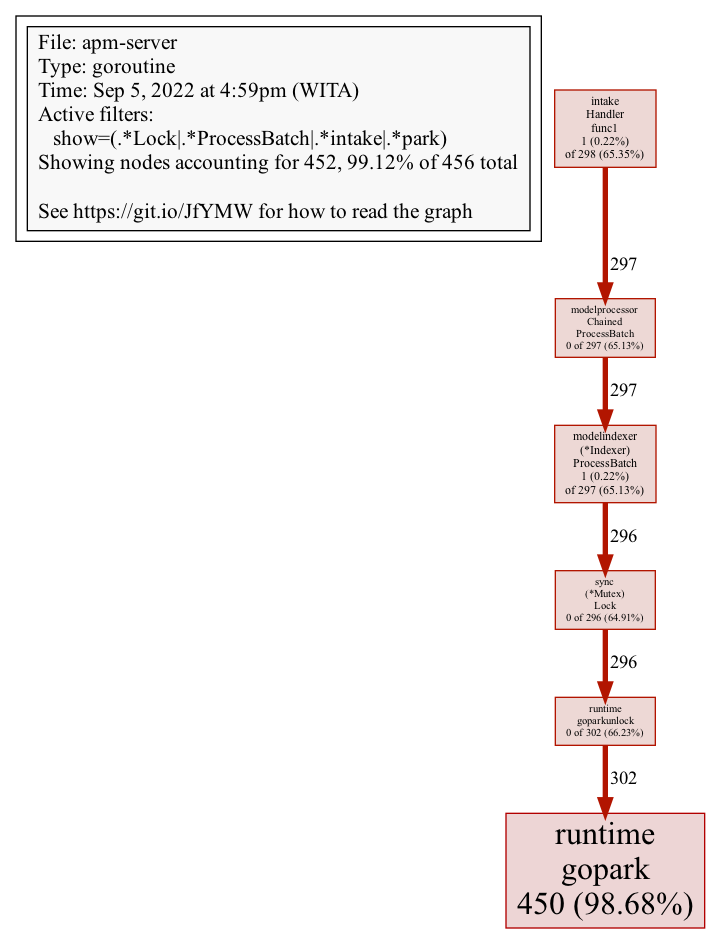

#### 3: ModelIndexer's is the bottleneck

After some investigation, the modelindexer compressed the received events by default when they are stored in the bulk
indexer cache. This is done with the `activeMu` lock held and is causing the entire processing pipeline to stop until
a [single event is compressed](https://github.com/elastic/apm-server/blob/57d94db8d8cc8a56003018921814a45b40fada46/internal/model/modelindexer/indexer.go#L270-L274).
If we can defer the compression for later and even better remove the `activeMu` lock so we don't have contention there,
the processing will progress much faster.

Since the modelindexer `activeMu` lock seems to be the offending component causing a significant bottleneck and reduced
throughput, we benchmarked a modified version of APM Server where the modelindexer `activeMu` lock is eliminated and a
new channel inside the modelindexer is introduced to decouple the cache writing from the HTTP request lifecycle. Also,
since we have a queue where the BulkRequestItems are sent before they are compressed, we can scale the compression and
flushing of the bulk indexers to increase the number of "active" consumers from the queue.

Preliminary results look great, yet it seems that we may be maxing the Elasticsearch cluster capacity, CPU usage and
queue sizes pretty high.

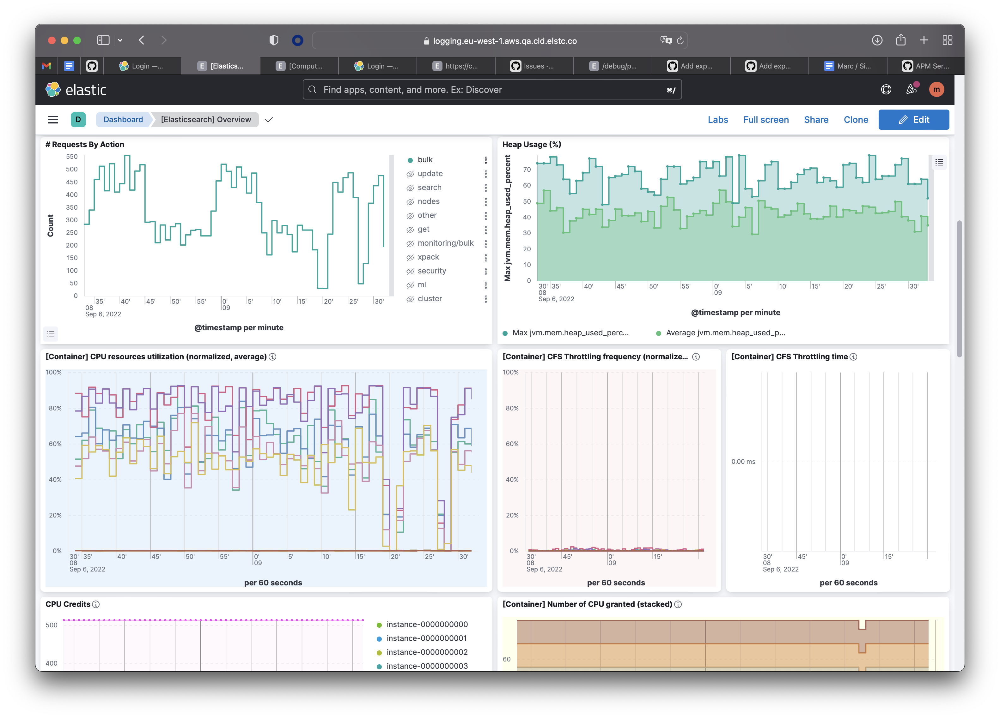
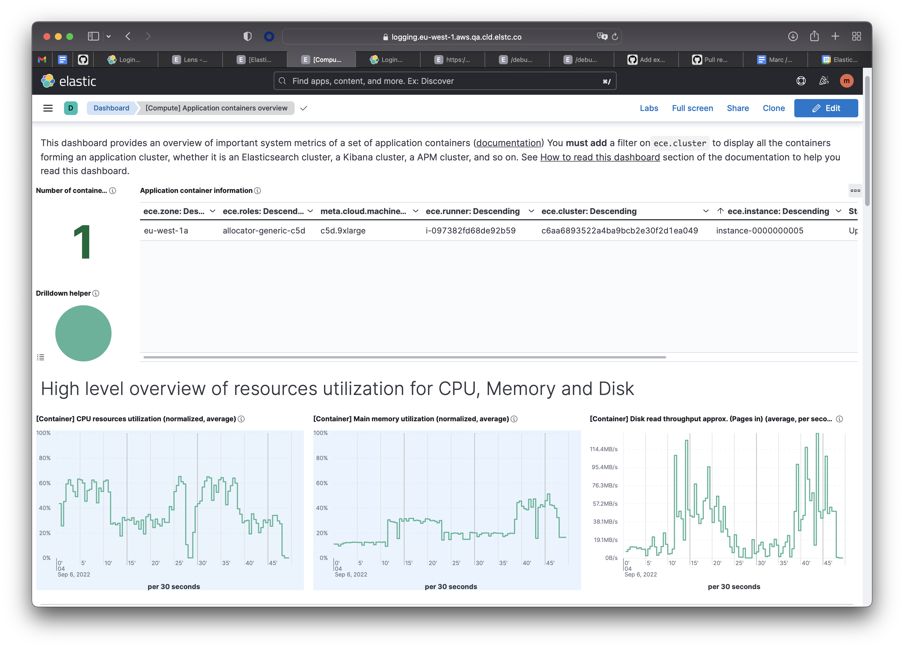

```console
name            old events/sec               new events/sec               delta
AgentAll-512                     25.2k ± 1%                   31.2k ± 3%   +24.01%  (p=0.100 n=3+3)
OTLPTraces-512                   50.1k ± 6%                   57.3k ± 5%   +14.17%  (p=0.100 n=3+3)
[Geo mean]                       35.5k                        42.3k        +18.99%
```

The APM Server CPU utilization is better, but still ~65%, in order to test that the current design can take advantage
of all the machine resources, the bulk indexer is modified to flush to the void, rather than to Elasticsearch.

Finally, as expected, the throughput skyrocketed. And so did the APM Server resource usage:

```console
name            old events/sec               new events/sec               delta
AgentAll-512                     31.2k ± 3%                   73.6k ± 0%   +135.81%  (p=0.100 n=3+3)
OTLPTraces-512                   57.3k ± 5%                  281.0k ± 0%   +390.70%  (p=0.100 n=3+3)
[Geo mean]                       42.3k                       143.8k        +240.16%
```

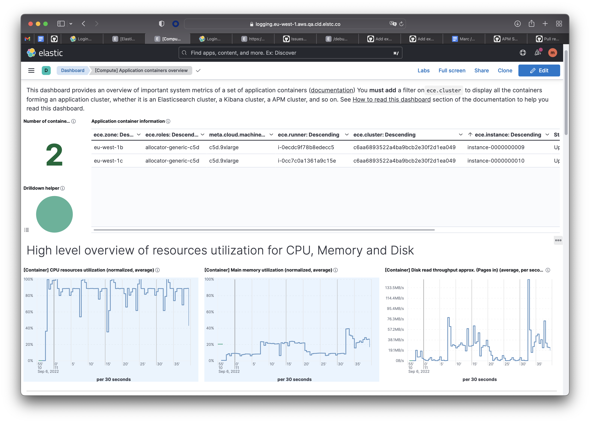

The semaphore was left untouched, so this performance was achieved with the 200 sized semaphore in place. It
kept the memory usage under control, but seemed to not reduce the throughput or limit it.

## Conclusion

APM Server is not currently suited to be scaled vertically past 8 Gigabytes of memory. The main reason seems to be
that the modelindexer design can't achieve a throughput past ~26500 events per second, for the reasons outlined in
this document.

As follow ups from this research, we should come up with a design that allows high throughput and to communicate back
payload problems to the producing agents. Currently, we would still respond with an error if a bulk indexer failed to
compress an agent's event, yet it is highly unlikely that the agent or customer is at fault for that. A better strategy
would be to log those errors and decouple the time intensive operations from agents requests, since not doing so slows
down the entire pipeline.
A PoC with autoscaling of active indexers can be found in: <https://github.com/marclop/apm-server/tree/vertical-scaling>.

## Appendix

The folder structure follows the following nomenclature:

    scaling/<multiple|single>-active-indexer/<apm-server-size>/flushbytes/<#>mb/<#indexers>/<csp>-<env>-<apm-server-size>-<shards>s-<agents>-a.txt

As an example, an APM Server benchmarked with 3MB as the maximum bulk indexer cache, with 10 available
bulk indexers, Elasticsearch indices configured with 15 shards each, and running the benchmarks with
512 agents:

    scaling/single-active-indexer/8g/flushbytes/3mb/10-default/aws-qa-8g-otlp-15s-512a.txt

To compare the benchmarks results, it's best to use `benchstat` and use a high `-alpha` with `-geomean` set.

The benchmarks have been run using `../bench.sh`.

The image tags which have been used to test the APM Server:

The comment nomenclature is `<semaphore>, <flush size>, <# indexers>`

```
docker_image_tag_override = {
  "elasticsearch" : "",
  "kibana" : "",
  "apm" : "8.5.0-b5001a6d-SNAPSHOT-marclop-1662526063", # 400, modelindexer no activeMu, 500queue, 20 active autoscaling 30 available, discard flush.
  # "apm" : "8.5.0-b5001a6d-SNAPSHOT-marclop-1662516556", # 400, modelindexer no activeMu, 200queue, 20 active autoscaling 30 available, discard flush.
  # "apm" : "8.5.0-b5001a6d-SNAPSHOT-marclop-1662515855", # default, modelindexer no activeMu, 200queue, 20 active autoscaling 30 available, discard flush.
  # "apm" : "8.5.0-b5001a6d-SNAPSHOT-marclop-1662513780", # default, modelindexer no activeMu, 30 active autoscaling 30 available, discard flush.
  # "apm" : "8.5.0-b5001a6d-SNAPSHOT-marclop-1662461165", # default, modelindexer no activeMu, 10 active autoscaling 80 available, discard flush.
  # "apm" : "8.5.0-b5001a6d-SNAPSHOT-marclop-1662455120", # no sem, modelindexer no activeMu, 10 active autoscaling 80 available
  # "apm": "8.5.0-b5001a6d-SNAPSHOT-marclop-1662451167", # default, modelindexer no activeMu, 10 active autoscaling 80 available
  # "apm": "8.5.0-b5001a6d-SNAPSHOT-marclop-1662448691", # default, modelindexer no activeMu, 10 active autoscaling
  # "apm": "8.5.0-b5001a6d-SNAPSHOT-marclop-1662431567", # default, modelindexer no activeMu
  # "apm": "8.5.0-b5001a6d-SNAPSHOT-marclop-1662358369", # no sem, 1mb flush, 40 indexers
  # "apm": "8.5.0-b5001a6d-SNAPSHOT-marclop-1662356831", # 400, 1mb flush, 40 indexers
  # "apm": "8.5.0-b5001a6d-SNAPSHOT-marclop-1662353932", # 400, 1mb flush, 20 indexers
  # "apm": "8.5.0-fedc3e60-SNAPSHOT-marclop-1662003115" # default, 1mb flush, 20 indexers
  #   "apm": "8.5.0-fedc3e60-SNAPSHOT-marclop-1662002998" # default, 1mb flush, 15 indexers
  #   "apm": "8.5.0-fedc3e60-SNAPSHOT-marclop-1662002948" # default, 1mb flush, 10 indexers
  #   "apm": "8.5.0-fedc3e60-SNAPSHOT-marclop-1662002827" # default, 2mb flush, 20 indexers
  #   "apm": "8.5.0-fedc3e60-SNAPSHOT-marclop-1662002773" # default, 2mb flush, 15 indexers
  #   "apm": "8.5.0-fedc3e60-SNAPSHOT-marclop-1662002691" # default, 2mb flush, 10 indexers
  #   "apm": "8.5.0-fedc3e60-SNAPSHOT-marclop-1661997044" # default, 3mb flush, 20 indexers
  #   "apm": "8.5.0-fedc3e60-SNAPSHOT-marclop-1661996995" # default, 3mb flush, 15 indexers
  #   "apm": "8.5.0-fedc3e60-SNAPSHOT-marclop-1661996822" # default, 3mb flush, 10 indexers
  #   "apm" : "8.5.0-fedc3e60-SNAPSHOT-marclop-1661945442", # 20 bulk indexers
  #   "apm" : "8.5.0-440e0896-SNAPSHOT-marclop-1661844748", # 15 bulk indexers
}
```
